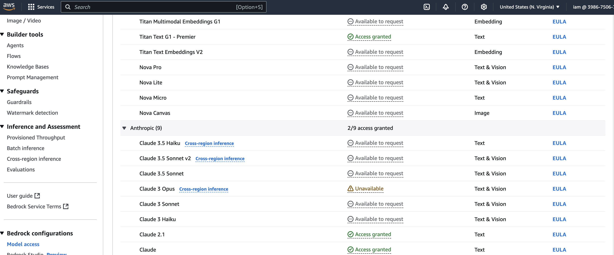

### Envt ####
    Maven 3.8.5 or greater
    Jdk 22
### Steps ###

    Configure the env variable AWS_ACCESS_KEY and AWS_SECRET_KEY and AWS_REGION (Set this as US-EAST since most of 
    models used are available in this region)
    Enable the models that are required to test the 2 scenarios. The model ids are configured in the application.properties.

### Sample Request/Response ###

The sample input format is available in samples 

For Anthropic Claude refer
(https://docs.aws.amazon.com/bedrock/latest/userguide/model-parameters-anthropic-claude-messages.html#model-parameters-anthropic-claude-messages-request-response)

#### Titan text endpoint

curl --location 'http://localhost:8081/titan/text' \
--header 'Content-Type: application/json' \
--data '{
"request" : "what is ai"
}'

#### Anthropic summarize endpoint
curl --location 'http://localhost:8081/antropic/textsummary' \
--header 'Content-Type: application/json' \
--data '{
"text": "I finally got to check out Alessandro’s Brilliant Pizza and it is now one of my favorite restaurants in Seattle. The dining room has a beautiful view over the Puget Sound but it was surprisingly not crowded. I ordered the fried castelvetrano olives, a spicy Neapolitan-style pizza and a gnocchi dish. The olives were absolutely decadent, and the pizza came with a smoked mozzarella, which was delicious. The gnocchi was fresh and wonderful. The waitstaff were attentive, and overall the experience was lovely. I hope to return soon ",
"request" : "Summarize the restaurant review in one sentence."
}'

